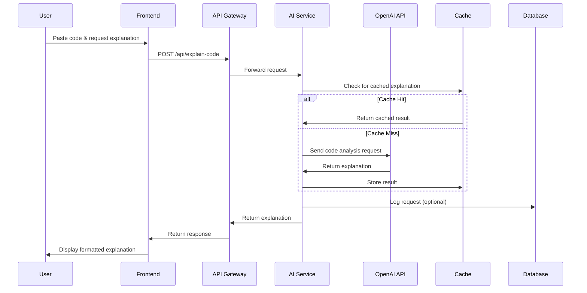
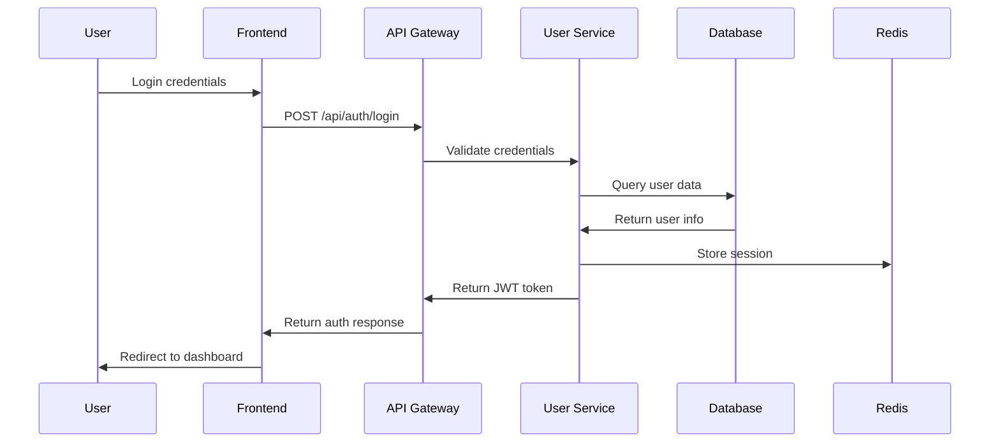
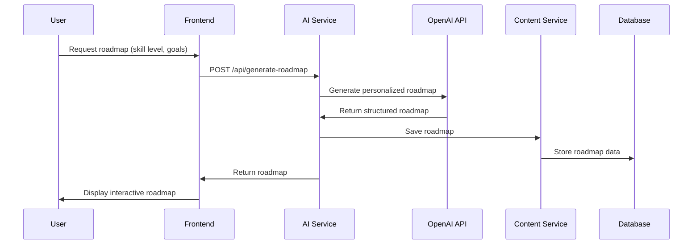

# AI Tech Learning Assistant - Design Document

## 1. System Architecture

### 1.1 High-Level Architecture

The AI Tech Learning Assistant follows a microservices architecture with the following key components:

```
┌─────────────────┐    ┌─────────────────┐    ┌─────────────────┐
│   Web Client    │    │  Mobile Web     │    │   Admin Panel   │
│   (React SPA)   │    │   (Responsive)  │    │   (Dashboard)   │
└─────────────────┘    └─────────────────┘    └─────────────────┘
         │                       │                       │
         └───────────────────────┼───────────────────────┘
                                 │
                    ┌─────────────────┐
                    │  Load Balancer  │
                    │   (NGINX/ALB)   │
                    └─────────────────┘
                                 │
                    ┌─────────────────┐
                    │   API Gateway   │
                    │  (Rate Limiting │
                    │ & Authentication)│
                    └─────────────────┘
                                 │
         ┌───────────────────────┼───────────────────────┐
         │                       │                       │
┌─────────────────┐    ┌─────────────────┐    ┌─────────────────┐
│  User Service   │    │  AI Service     │    │ Content Service │
│  (Auth & Profile)│    │ (Core AI Logic) │    │(Notes & Roadmaps)│
└─────────────────┘    └─────────────────┘    └─────────────────┘
         │                       │                       │
         └───────────────────────┼───────────────────────┘
                                 │
                    ┌─────────────────┐
                    │   Data Layer    │
                    │ (PostgreSQL +   │
                    │  Redis Cache)   │
                    └─────────────────┘
```

### 1.2 Technology Stack

**Frontend:**
- React 18 with TypeScript
- Tailwind CSS for styling
- Monaco Editor for code input
- React Query for state management
- Vite for build tooling

**Backend:**
- Node.js with Express.js
- TypeScript for type safety
- PostgreSQL for persistent data
- Redis for caching and sessions
- JWT for authentication

**AI Integration:**
- OpenAI GPT-4 API
- Anthropic Claude API (fallback)
- Custom prompt engineering
- Response caching layer

**Infrastructure:**
- Docker containers
- AWS/GCP cloud deployment
- CDN for static assets
- Monitoring with Prometheus/Grafana

## 2. Component Design

### 2.1 Frontend Components

#### 2.1.1 Core UI Components
```typescript
// Main application shell
interface AppShellProps {
  user: User | null;
  children: React.ReactNode;
}

// Code input component with syntax highlighting
interface CodeInputProps {
  language: string;
  value: string;
  onChange: (value: string) => void;
  placeholder?: string;
}

// AI response display with formatting
interface AIResponseProps {
  response: AIResponse;
  isLoading: boolean;
  onRetry?: () => void;
}

// Learning roadmap visualization
interface RoadmapViewProps {
  roadmap: LearningRoadmap;
  progress: UserProgress;
  onUpdateProgress: (milestoneId: string) => void;
}
```

#### 2.1.2 Feature-Specific Components
- **CodeExplainer**: Handles code input and explanation display
- **DebugAssistant**: Manages error input and debugging suggestions
- **RoadmapGenerator**: Creates and displays learning paths
- **NoteSummarizer**: Processes and summarizes technical content
- **UserDashboard**: Shows progress and saved content

### 2.2 Backend Services

#### 2.2.1 User Service
```typescript
interface UserService {
  // Authentication
  register(userData: RegisterRequest): Promise<User>;
  login(credentials: LoginRequest): Promise<AuthResponse>;
  refreshToken(token: string): Promise<AuthResponse>;
  
  // Profile management
  getProfile(userId: string): Promise<UserProfile>;
  updateProfile(userId: string, updates: ProfileUpdate): Promise<UserProfile>;
  
  // Progress tracking
  updateProgress(userId: string, progress: ProgressUpdate): Promise<void>;
  getProgress(userId: string): Promise<UserProgress>;
}
```

#### 2.2.2 AI Service
```typescript
interface AIService {
  // Code explanation
  explainCode(request: CodeExplanationRequest): Promise<CodeExplanation>;
  
  // Debugging assistance
  analyzeError(request: ErrorAnalysisRequest): Promise<DebugSuggestions>;
  
  // Learning roadmap generation
  generateRoadmap(request: RoadmapRequest): Promise<LearningRoadmap>;
  
  // Content summarization
  summarizeContent(request: SummarizationRequest): Promise<ContentSummary>;
}
```

#### 2.2.3 Content Service
```typescript
interface ContentService {
  // Save user content
  saveExplanation(userId: string, explanation: SavedExplanation): Promise<string>;
  saveRoadmap(userId: string, roadmap: SavedRoadmap): Promise<string>;
  saveSummary(userId: string, summary: SavedSummary): Promise<string>;
  
  // Retrieve user content
  getUserContent(userId: string, type: ContentType): Promise<SavedContent[]>;
  getContentById(contentId: string): Promise<SavedContent>;
  
  // Content management
  deleteContent(contentId: string): Promise<void>;
  updateContent(contentId: string, updates: ContentUpdate): Promise<SavedContent>;
}
```

## 3. Data Flow

### 3.1 Code Explanation Flow



### 3.2 User Authentication Flow



### 3.3 Learning Roadmap Generation Flow



## 4. API Design

### 4.1 Authentication Endpoints

```typescript
// POST /api/auth/register
interface RegisterRequest {
  email: string;
  password: string;
  name: string;
  skillLevel: 'beginner' | 'intermediate' | 'advanced';
}

// POST /api/auth/login
interface LoginRequest {
  email: string;
  password: string;
}

// POST /api/auth/refresh
interface RefreshRequest {
  refreshToken: string;
}
```

### 4.2 AI Feature Endpoints

```typescript
// POST /api/explain-code
interface CodeExplanationRequest {
  code: string;
  language: string;
  explanationLevel: 'basic' | 'detailed' | 'expert';
  focusAreas?: string[];
}

interface CodeExplanationResponse {
  explanation: {
    overview: string;
    lineByLine: LineExplanation[];
    concepts: ConceptExplanation[];
    improvements: string[];
  };
  processingTime: number;
  cached: boolean;
}

// POST /api/debug-error
interface ErrorAnalysisRequest {
  errorMessage: string;
  stackTrace?: string;
  code?: string;
  language: string;
  context?: string;
}

interface DebugSuggestionsResponse {
  analysis: {
    errorType: string;
    rootCause: string;
    severity: 'low' | 'medium' | 'high';
  };
  solutions: Solution[];
  preventionTips: string[];
}

// POST /api/generate-roadmap
interface RoadmapRequest {
  domain: 'web-dev' | 'data-science' | 'mobile-dev' | 'devops';
  currentSkills: string[];
  goals: string[];
  timeCommitment: number; // hours per week
  experience: 'beginner' | 'intermediate' | 'advanced';
}

interface LearningRoadmapResponse {
  roadmap: {
    title: string;
    description: string;
    estimatedDuration: string;
    milestones: Milestone[];
  };
  customized: boolean;
}

// POST /api/summarize-content
interface SummarizationRequest {
  content: string;
  contentType: 'documentation' | 'article' | 'notes';
  summaryLength: 'brief' | 'detailed';
  focusAreas?: string[];
}

interface ContentSummaryResponse {
  summary: {
    overview: string;
    keyPoints: string[];
    codeExamples: CodeExample[];
    outline: OutlineSection[];
  };
  originalLength: number;
  summaryLength: number;
}
```

### 4.3 Content Management Endpoints

```typescript
// GET /api/user/content
interface GetUserContentRequest {
  type?: 'explanations' | 'roadmaps' | 'summaries';
  limit?: number;
  offset?: number;
}

// POST /api/user/content/save
interface SaveContentRequest {
  type: 'explanation' | 'roadmap' | 'summary';
  title: string;
  content: any;
  tags?: string[];
}

// PUT /api/user/progress
interface UpdateProgressRequest {
  roadmapId: string;
  milestoneId: string;
  status: 'completed' | 'in-progress' | 'not-started';
  notes?: string;
}
```

## 5. AI Workflow

### 5.1 Prompt Engineering Strategy

#### 5.1.1 Code Explanation Prompts
```typescript
const CODE_EXPLANATION_PROMPT = `
You are an expert programming tutor. Explain the following ${language} code in a clear, educational manner.

Code:
\`\`\`${language}
${code}
\`\`\`

Provide:
1. A brief overview of what the code does
2. Line-by-line explanation for complex parts
3. Key programming concepts used
4. Potential improvements or best practices
5. Common pitfalls to avoid

Explanation level: ${explanationLevel}
Target audience: ${targetAudience}
`;
```

#### 5.1.2 Error Analysis Prompts
```typescript
const ERROR_ANALYSIS_PROMPT = `
You are a debugging expert. Analyze this error and provide helpful solutions.

Error: ${errorMessage}
${stackTrace ? `Stack Trace: ${stackTrace}` : ''}
${code ? `Related Code: ${code}` : ''}
Language: ${language}

Provide:
1. Error type and root cause analysis
2. 3-5 ranked solutions (most likely first)
3. Step-by-step debugging approach
4. Prevention strategies
5. Related documentation links

Be specific and actionable.
`;
```

#### 5.1.3 Roadmap Generation Prompts
```typescript
const ROADMAP_PROMPT = `
Create a personalized learning roadmap for ${domain} development.

User Profile:
- Experience: ${experience}
- Current Skills: ${currentSkills.join(', ')}
- Goals: ${goals.join(', ')}
- Time Commitment: ${timeCommitment} hours/week

Generate a structured roadmap with:
1. 8-12 progressive milestones
2. Estimated timeframes for each milestone
3. Specific resources (courses, books, projects)
4. Practical projects to build
5. Skills assessment checkpoints

Make it realistic and achievable.
`;
```

### 5.2 AI Response Processing

#### 5.2.1 Response Validation
```typescript
interface AIResponseValidator {
  validateCodeExplanation(response: string): ValidationResult;
  validateDebugSuggestions(response: string): ValidationResult;
  validateRoadmap(response: string): ValidationResult;
  validateSummary(response: string): ValidationResult;
}

interface ValidationResult {
  isValid: boolean;
  errors: string[];
  warnings: string[];
  confidence: number;
}
```

#### 5.2.2 Response Enhancement
```typescript
interface ResponseEnhancer {
  addSyntaxHighlighting(code: string, language: string): string;
  formatExplanation(explanation: string): FormattedExplanation;
  enrichWithLinks(content: string): EnrichedContent;
  addInteractiveElements(roadmap: RoadmapData): InteractiveRoadmap;
}
```

### 5.3 Caching Strategy

#### 5.3.1 Cache Key Generation
```typescript
interface CacheKeyGenerator {
  generateCodeExplanationKey(request: CodeExplanationRequest): string;
  generateErrorAnalysisKey(request: ErrorAnalysisRequest): string;
  generateRoadmapKey(request: RoadmapRequest): string;
}

// Example implementation
const generateCodeExplanationKey = (request: CodeExplanationRequest): string => {
  const codeHash = crypto.createHash('sha256').update(request.code).digest('hex');
  return `code_explanation:${request.language}:${request.explanationLevel}:${codeHash}`;
};
```

#### 5.3.2 Cache Management
```typescript
interface CacheManager {
  get<T>(key: string): Promise<T | null>;
  set<T>(key: string, value: T, ttl: number): Promise<void>;
  invalidate(pattern: string): Promise<void>;
  getStats(): Promise<CacheStats>;
}

// Cache TTL configuration
const CACHE_TTL = {
  CODE_EXPLANATION: 24 * 60 * 60, // 24 hours
  ERROR_ANALYSIS: 12 * 60 * 60,   // 12 hours
  ROADMAP: 7 * 24 * 60 * 60,      // 7 days
  SUMMARY: 24 * 60 * 60,          // 24 hours
};
```

## 6. Data Models

### 6.1 User Data Models

```typescript
interface User {
  id: string;
  email: string;
  name: string;
  skillLevel: 'beginner' | 'intermediate' | 'advanced';
  preferences: UserPreferences;
  createdAt: Date;
  updatedAt: Date;
}

interface UserPreferences {
  defaultLanguage: string;
  explanationLevel: 'basic' | 'detailed' | 'expert';
  theme: 'light' | 'dark';
  notifications: NotificationSettings;
}

interface UserProgress {
  userId: string;
  roadmaps: RoadmapProgress[];
  completedMilestones: string[];
  totalLearningTime: number;
  achievements: Achievement[];
}
```

### 6.2 Content Data Models

```typescript
interface SavedExplanation {
  id: string;
  userId: string;
  title: string;
  code: string;
  language: string;
  explanation: CodeExplanation;
  tags: string[];
  createdAt: Date;
}

interface LearningRoadmap {
  id: string;
  title: string;
  description: string;
  domain: string;
  milestones: Milestone[];
  estimatedDuration: string;
  difficulty: 'beginner' | 'intermediate' | 'advanced';
}

interface Milestone {
  id: string;
  title: string;
  description: string;
  skills: string[];
  resources: Resource[];
  projects: Project[];
  estimatedHours: number;
  prerequisites: string[];
}

interface ContentSummary {
  id: string;
  title: string;
  originalContent: string;
  summary: string;
  keyPoints: string[];
  outline: OutlineSection[];
  contentType: 'documentation' | 'article' | 'notes';
}
```

## 7. Security Considerations

### 7.1 Authentication & Authorization
- JWT-based authentication with refresh tokens
- Role-based access control (user, admin)
- Session management with Redis
- Password hashing with bcrypt

### 7.2 Data Protection
- TLS 1.3 encryption for all communications
- Input validation and sanitization
- SQL injection prevention with parameterized queries
- XSS protection with Content Security Policy

### 7.3 AI Security
- Rate limiting on AI API calls
- Input length restrictions
- Content filtering for malicious code
- API key rotation and monitoring

### 7.4 Privacy Compliance
- GDPR-compliant data handling
- User data anonymization options
- Right to deletion implementation
- Audit logging for compliance

## 8. Performance Optimization

### 8.1 Frontend Optimization
- Code splitting and lazy loading
- Image optimization and CDN usage
- Service worker for offline functionality
- Bundle size monitoring

### 8.2 Backend Optimization
- Database query optimization
- Connection pooling
- Response compression
- Horizontal scaling with load balancers

### 8.3 AI Performance
- Response caching strategy
- Batch processing for multiple requests
- Model selection based on complexity
- Fallback mechanisms for API failures

## 9. Monitoring & Analytics

### 9.1 System Monitoring
- Application performance monitoring (APM)
- Error tracking and alerting
- Infrastructure monitoring
- Database performance metrics

### 9.2 User Analytics
- Feature usage tracking
- User journey analysis
- A/B testing framework
- Conversion funnel monitoring

### 9.3 AI Metrics
- Response quality scoring
- Processing time tracking
- Cache hit rates
- Cost per request monitoring